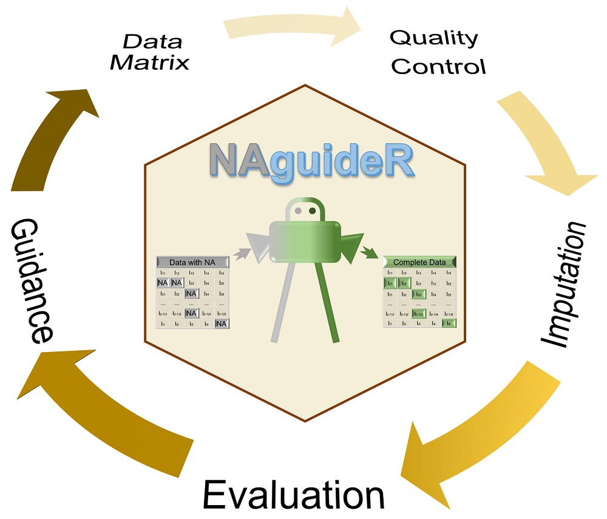
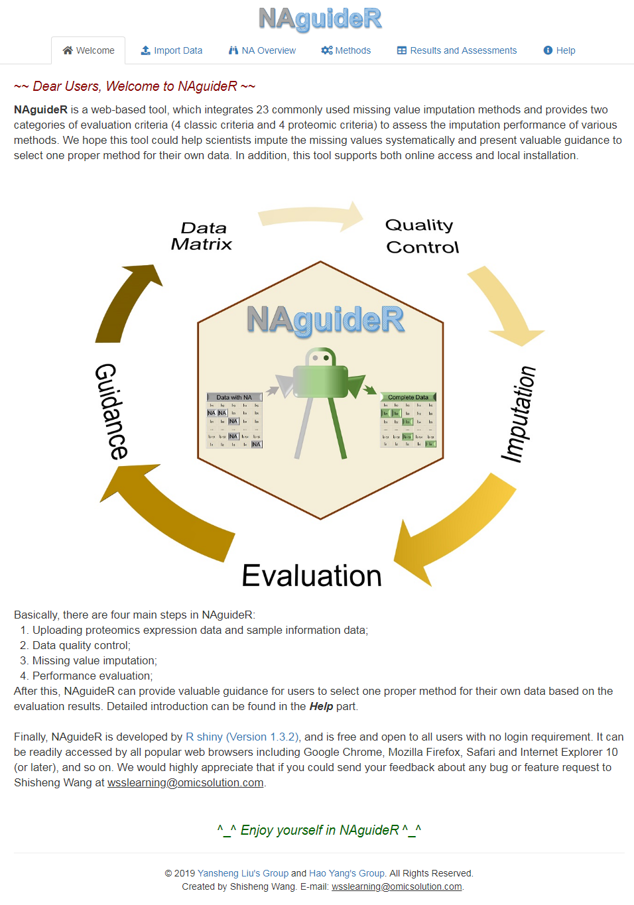

# NAguideR
NAguideR: performing and prioritizing missing value imputations for consistent bottom-up proteomic analyses

## Brief Description
**<font size='5'> NAguideR </font>** is a web-based tool, which integrates 23 common missing value imputation methods and provides two categories of evaluation criteria (4 classic criteria and 4 proteomic criteria) to assess the imputation performance of various methods. We hope this tool could help scientists impute the missing values systematically and present valuable guidance to select one proper method for their own data. In addition, this tool supports both online access and local installation. The online version can be linked from here: [https://www.omicsolution.org/wukong/NAguideR](https://www.omicsolution.org/wukong/NAguideR).

## Software Manual
A detailed introduction of this software can be found in [NAguideR_Manual.pdf](https://github.com/wangshisheng/NAguideR/blob/master/NAguideR_Manual.pdf) file.

## Preparation for local installation
This tool is developed with R, so if you want to run it locally, you may do some preparatory work:  
**1. Install R.** You can download R from here: [https://www.r-project.org/](https://www.r-project.org/).  
**2. Install RStudio.** (Recommendatory but not necessary). You can download RStudio from here: [https://www.rstudio.com/](https://www.rstudio.com/).  
**3. Check packages.** After installing R and RStudio, you should check whether you have installed these packages (shiny, shinyBS, shinyjs, shinyWidgets, DT, gdata, ggplot2, ggsci, openxlsx, data.table, DT, raster, Metrics, vegan, tidyverse, ggExtra, cowplot, Amelia, e1071, impute, SeqKnn, pcaMethods, norm, imputeLCMD, VIM, rrcovNA, mice, missFores, GMSimpute, DreamAI). You may run the codes below to check them:  

```r
if(!require(pacman)) install.packages("pacman")
pacman::p_load(shiny, shinyBS, shinyjs, shinyWidgets, DT, gdata, ggplot2, ggsci, openxlsx, data.table, DT, raster, Metrics, vegan, tidyverse, ggExtra, cowplot, Amelia, e1071, impute, SeqKnn, pcaMethods, norm, imputeLCMD, VIM, rrcovNA, mice, missFores, DreamAI)
```

Please note, you may find the [SeqKnn](https://github.com/cran/SeqKnn) package can not be installed rightly as it has not been updated for a long time. If so, please download this package from here: [SeqKnn_1.0.1.tar.gz](https://github.com/wangshisheng/NAguideR/blob/master/SeqKnn_1.0.1.tar.gz). In addition, we also change some functions slightly in [GMSimpute](https://cran.r-project.org/web/packages/GMSimpute/index.html) package, you can download it from here: [GMSimpute](https://github.com/wangshisheng/NAguideR/blob/master/GMSimpute_0.0.1.1.tar.gz). Then you can install the two packages locally:

```r
setwd('path') #path is where the two packages are.
install.packages("SeqKnn_1.0.1.tar.gz", repos = NULL,type="source")
install.packages("GMSimpute_0.0.1.1.tar.gz", repos = NULL,type="source")
```

## Run it locally
If the preparatory work has been done, you can run this tool locally as below:
```r
if(!require(NAguideR)) devtools::install_github("wangshisheng/NAguideR")
library(NAguideR)
NAguideR_app()
```

Then NAguideR will be started as below:




Enjoy yourself^_^


## Friendly suggestion
1. Open NAguideR with Chrome or Firefox.
2. The minimum operating system specifications are: **RAM 4GB, Hard drive 100 GB.**


## Contact
You could push an issue on this github. And optionally, please feel free to sent me an e-mail if you have any question or find a bug about this tool. Thank you^_^
Email: wsslearning@omicsolution.com

